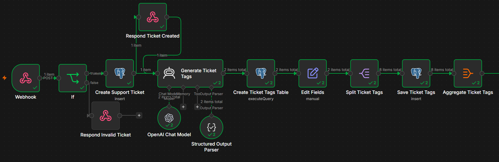
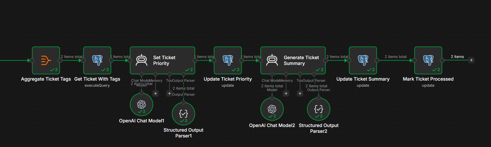

# AI Customer Support Automation

AI-powered customer support workflow built with **n8n, OpenAI and PostgreSQL**.

The system receives support tickets through an authenticated webhook, validates and stores them, then automatically generates tags, determines priority, creates a concise summary and marks the ticket as processed.

## Features

- REST webhook for receiving support tickets
- Header-based API authentication
- Input validation
- PostgreSQL ticket storage
- AI-generated ticket tags
- Dynamic number of tags per ticket
- AI-based priority classification
- AI-generated ticket summaries
- Structured AI outputs
- Automatic ticket status updates
- Separate relational storage for ticket tags

## Tech Stack

- **n8n** — workflow orchestration
- **OpenAI GPT-5 mini** — ticket analysis
- **PostgreSQL** — persistent storage
- **SQL** — relational queries and ticket/tag aggregation
- **REST / Webhooks** — ticket ingestion

## Workflow

### 1. Ticket ingestion and AI tagging

A request enters through an authenticated webhook. The workflow validates the request, creates the ticket in PostgreSQL and uses an AI agent to generate relevant tags.



### 2. Priority, summary and final processing

The generated tags are stored separately and joined back to the ticket. AI then determines the ticket priority and generates a short support summary. Finally, the ticket is marked as `processed`.



## Processing Pipeline

```text
POST /support/ticket
        ↓
Authentication
        ↓
Validation
        ↓
Create Ticket
        ↓
Generate AI Tags
        ↓
Store Ticket Tags
        ↓
Fetch Ticket + Tags
        ↓
Determine AI Priority
        ↓
Generate AI Summary
        ↓
Mark Ticket Processed
```

## API Example

### Request

```http
POST /support/ticket
Content-Type: application/json
X-API-Key: <your-api-key>
```

```json
{
  "user_id": 7315,
  "name": "Michael",
  "email": "michael@example.com",
  "subject": "Cannot login after password reset",
  "message": "I reset my password twice but I still cannot log into my account. I need access as soon as possible.",
  "order_id": "ORD-7315",
  "product": "SaaS"
}
```

### Initial Response

```json
{
  "success": true,
  "message": "Support ticket created",
  "ticket_id": 4,
  "status": "new"
}
```

The remaining processing continues automatically inside the workflow.

## Processed Ticket

After processing, the ticket contains additional AI-generated information:

```json
{
  "id": 4,
  "status": "processed",
  "priority": "urgent",
  "tags": [
    "account-access",
    "password-reset",
    "login-issue"
  ],
  "summary": "Customer cannot access their account after multiple password resets and requires urgent assistance."
}
```

AI-generated values vary depending on ticket content.

## Database

The project uses two relational tables:

### `tickets`

Stores the original support request together with generated priority, summary and processing status.

### `ticket_tags`

Stores a dynamic number of AI-generated tags associated with each ticket through `ticket_id`.

The complete database schema is available in [`schema.sql`](schema.sql).

## Setup

1. Create a PostgreSQL database.
2. Run `schema.sql`.
3. Import `workflow.json` into n8n.
4. Configure PostgreSQL credentials in n8n.
5. Configure OpenAI API credentials.
6. Configure Header Auth for the webhook.
7. Activate the workflow.
8. Send a POST request to `/support/ticket`.

> Credentials and API keys are intentionally not included in this repository.

## Repository Structure

```text
.
├── README.md
├── schema.sql
├── workflow.json
├── workflow-part-one.png
└── Workflow-part-two.png
```

## What This Project Demonstrates

This project demonstrates practical experience with:

- AI workflow automation
- n8n workflow design
- OpenAI integration
- Structured LLM outputs
- REST APIs and webhooks
- PostgreSQL
- SQL joins and relational data
- Data validation and transformation
- Multi-step backend automation
